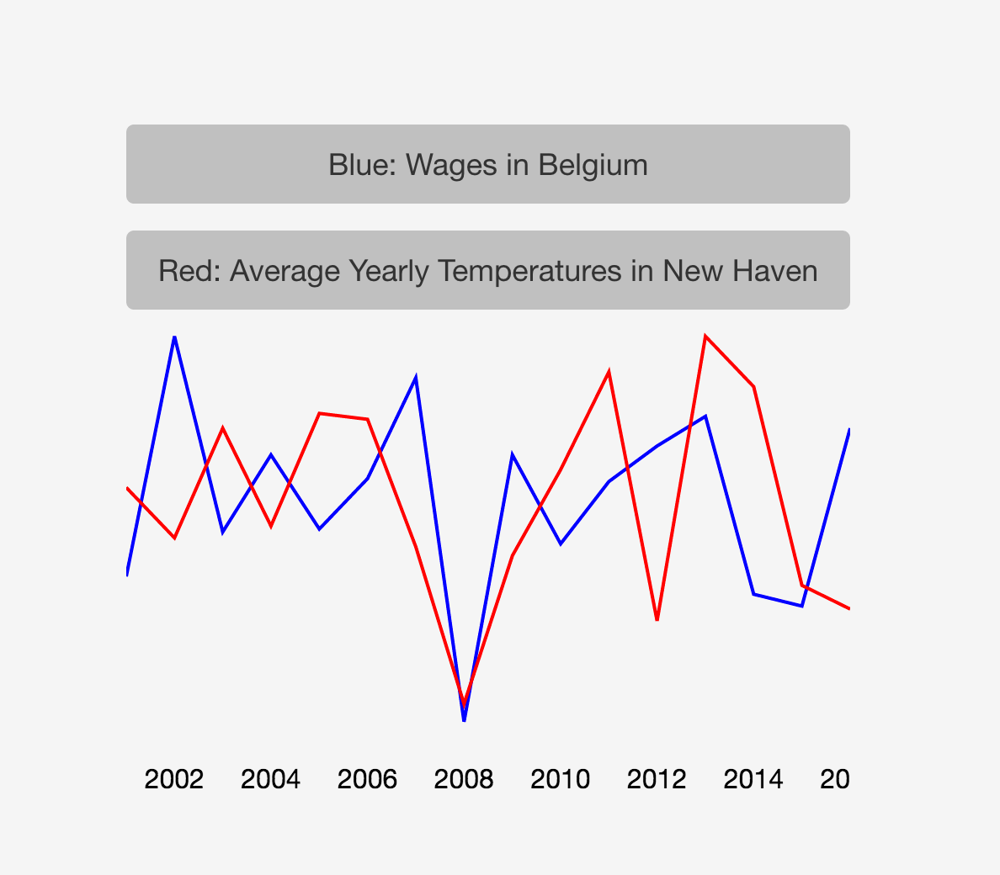

[react-search-example](https://springload.github.io/react-search-example/)
=============

> An example of using React with D3, Lunr.js and an autocomplete UI to build a keyboard-centric search experience. Oh and service workers for offline caching, and Electron just because. [Demo](https://springload.github.io/react-search-example/)

[](https://springload.github.io/react-search-example/)

Head over to the [Releases](https://github.com/springload/react-search-example/releases/tag/v0.1.0) to download the desktop version.

## Installation

> You first need to clone the project on your computer, and to install [Node](https://nodejs.org). This project also uses [nvm](https://github.com/creationix/nvm).

From the command-line:

```sh
cd ~/Development/sites/
git clone git@github.com:springload/react-search-example.git
cd react-example
```

To install our dependencies:

```sh
nvm install
npm install --global eslint eslint-plugin-react babel-eslint eslint-config-airbnb sass-lint
# Then, install all project dependencies.
npm install
# Optionally, install the git hooks.
./.githooks/deploy
```

## Working on the project

> Everything mentioned in the installation process should already be done.

```sh
# Start the server and the development tools.
npm run start
# Run the project within Electron
npm run start:electron
# Builds frontend assets.
npm run build
# Packages binaries with Electron
npm run build:electron
# Runs linting.
npm run lint
# Runs tests.
npm run test
```

## Deploying a new version

### To production (`gh-pages`)

```sh
# From the project's root.
# First make sure your master is up to date.
git fetch --all
git checkout master
git pull
git push origin master
# Then push the new changes
git checkout gh-pages
git merge master
npm run dist
git add .
git commit -m 'Release new version'
git push origin gh-pages
# And get back to master!
git checkout master
```

## Documentation

- Datasets taken from https://github.com/vincentarelbundock/Rdatasets.
- Icon made with 📈 and 📉 from http://emojione.com/.

This project relies on a modified version of `react-autosuggest` so that the suggestions are always displayed.
